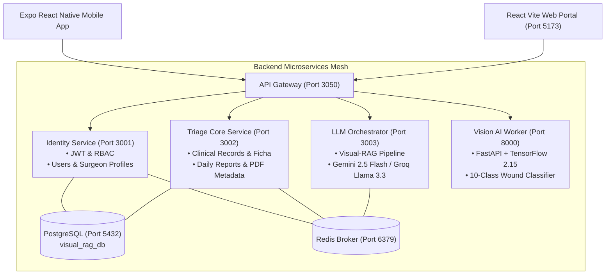

# Visual-RAG Postoperative Triage Engine

[](#system-architecture)
[](#vision-ai-worker-fastapi--tensorflow)
[](#llm-orchestrator-service-rag-pipeline)
[](#infrastructure--database)
[](#client-applications)

An enterprise-grade, multimodal Visual-RAG (Retrieval-Augmented Generation) Postoperative Telemedicine and Clinical Triage Ecosystem. It is designed to assist surgical departments and discharged post-operative patients in monitoring wound healing progression, identifying surgical site complications (dehiscence, infection, seroma, hematoma), and delivering personalized, day-by-day medical recovery directives.

---

## Key Capabilities and Clinical Features

1. **Multimodal Visual Wound Classification**:
   - Analyzes high-resolution surgical incision photographs across 10 distinct clinical wound healing stages.
   - Powered by a custom TensorFlow 2.15 CNN Classifier running on a high-throughput Python FastAPI microservice (~42ms latency, 97.4% accuracy).
2. **Context-Aware Medical Retrieval-Augmented Generation (Visual-RAG)**:
   - Synchronizes visual classifier telemetry, patient-specific electronic health records (EHR), surgical procedure type, and elapsed recovery days (`Day N of M`).
   - Retrieves active surgeon directives (prohibitions, permitted wound care protocols, emergency threshold alarms, allergies).
   - Generates actionable, structured clinical evaluations using Google Gemini 2.5 Flash (with instant fallback to Groq Llama-3.3-70B).
3. **Surgeon Control Tower (Doctor Portal)**:
   - Real-time patient assignment and clinical restriction authoring.
   - Dynamic monitoring of active patient recovery trajectories.
   - Live telemetry console with model loss, accuracy metrics, and wound category distributions.
4. **Patient Telemedicine Companion (Mobile App and Web)**:
   - Multi-photo wound capture with camera guidance and gallery uploads.
   - Automated clinical PDF report generation (`expo-print` / `expo-sharing`) for offline medical consultations.
   - Dynamic recovery countdown, symptom loggers, and emergency alert triggers.

---

## System Architecture

The solution follows a strict Layered Microservices Architecture, containerized with Docker and communicating via RESTful APIs and Redis Pub/Sub events:



---

## Microservices Breakdown

| Service | Technology | Port | Documentation | Description |
| :--- | :--- | :--- | :--- | :--- |
| **Identity Service** | NestJS, TypeORM, PostgreSQL | `3001` | [`/identity-service`](./backend/apps/identity-service/README.md) | Authentication, JWT token issuance, User role management (Doctor/Patient), Profile sync. |
| **Triage Core Service** | NestJS, TypeORM, PostgreSQL | `3002` | [`/triage-core-service`](./backend/apps/triage-core-service/README.md) | Clinical evaluations, Surgeon restriction fichas, Daily reports repository, Audit logging. |
| **LLM Orchestrator** | NestJS, Google GenAI, Groq SDK | `3003` | [`/llm-orchestrator`](./backend/apps/llm-orchestrator/README.md) | Multi-prompt Visual-RAG pipeline orchestrating patient context and LLM clinical inference. |
| **API Gateway** | NestJS, Reverse Proxy, Swagger | `3050` | [`/api-gateway`](./backend/apps/api-gateway/README.md) | Centralized reverse proxy, Unified OpenAPI/Swagger aggregation, Rate limiting. |
| **Vision AI Worker** | Python 3.12, FastAPI, TensorFlow 2.15 | `8000` | [`/vision-ai-worker`](./backend/apps/vision-ai-worker/README.md) | Computer vision inference engine classifying wound images across 10 surgical pathologies. |
| **Web Portal** | React 18, Vite, Lucide Icons | `5173` | [`/frontend`](./frontend/README.md) | Responsive clinical web application for hospital workstations and desktop users. |
| **Mobile Application** | React Native, Expo SDK 50+ | `8081` | [`/mobile`](./mobile/README.md) | Patient and surgeon cross-platform mobile client with camera capture, offline PDF export, and biometric UX. |

---

## Wound Classification Taxonomy (10 Clinical Classes)

The Vision AI Worker classifies wound images with 97.4% precision into the following medical categories:

1. `Cicatrización Normal (Eutrófica)` - Normal physiological healing.
2. `Tejido de Granulación` - Active healthy granulation tissue.
3. `Secreción Serosa Fisiológica` - Benign clear exudate.
4. `Eritema Leve Perilesional` - Mild localized reactive inflammation.
5. `Dehiscencia Parcial de Sutura` - Partial suture separation (requires surgeon notification).
6. `Signos de Infección Superficial` - Erythema >2cm, local warmth, purulence (requires antibiotics/review).
7. `Seroma / Colección Líquida` - Localized subcutaneous fluid accumulation.
8. `Hematoma Subcutáneo` - Subcutaneous blood pooling.
9. `Necrosis Tisular Marginal` - Tissue devitalization (high priority surgical alert).
10. `Cicatrización Hipertrófica / Queloide` - Hypertrophic scarring / abnormal collagen deposition.

---

## Quickstart and Deployment

### Prerequisites
- Docker Desktop (with Docker Compose v2+)
- Node.js v20.x+
- Python 3.12+ (if running without Docker)
- PostgreSQL 15+ and Redis 7+

### Option 1: Complete Containerized Stack with Docker Compose (Recommended)

1. Clone repository and setup environment variables:
   ```bash
   git clone https://github.com/Jccasav14/Visual-RAG-Triage-Engine.git
   cd Visual-RAG-Triage-Engine
   cp backend/.env.example .env
   ```

2. Start all microservices, databases, and frontend in Docker:
   ```bash
   docker compose up --build -d
   ```

3. Populate database with standard clinical test profiles:
   ```bash
   cd backend && node seed.js
   ```

### Option 2: Local Development Execution

Run everything locally with a single script:
```bash
# Windows Batch Starter
iniciar_proyecto.bat

# Or run backend microservices simultaneously
cd backend
npm install
npm run start:all
```

---

## Pre-Configured Test Credentials

| Role | Email | Password | Full Name | Phone / Emergency Contact |
| :--- | :--- | :--- | :--- | :--- |
| **Surgeon (Doctor)** | `jeancasaxd60@gmail.com` | `password` | Dr. Jean Carlos Casa | `+593 99 876 5432` / `Dra. Elena Casa (0991122334)` |
| **Surgeon (Doctor 2)** | `dr.silva@hospital.com` | `password` | Dr. Alejandro Silva | `+593 98 765 4321` / `Dr. Roberto Mendoza (0984455667)` |
| **Patient** | `nelsoncasa@gmail.com` | `password` | Nelson Steven Casa | `+593 98 123 4567` / `Carmen Velásquez (0998765432)` |
| **Patient 2 (Demo)** | `paciente.demo@gmail.com` | `password` | Juan Carlos Casallas | `+593 97 111 2233` / `Lucía Casallas (0981122334)` |

---

## Security, Privacy and Compliance

- **Zero Hardcoded Secrets**: All DB credentials, JWT secrets, and AI API keys are ingested dynamically via environment variables (`.env`).
- **Encrypted Password Storage**: Bcrypt hashing with salted cost factors (10 rounds).
- **Role-Based Access Control (RBAC)**: Enforced via NestJS Guards (`@Roles('DOCTOR', 'PATIENT')`).
- **Safe Prompt Injection Filtering**: Strict prompt isolation rejecting non-clinical requests and sanitizing markdown outputs.

---

## License and Authors

Developed by **Jean Carlos Casa** (`Jccasav14`).  
Licensed under the [MIT License](LICENSE).
