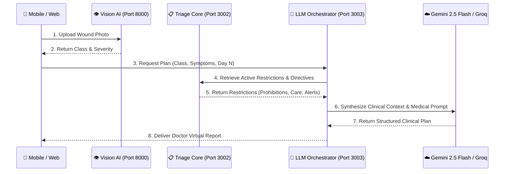

# 🧠 LLM Orchestrator Service (Visual-RAG Pipeline)

[](#)
[](#)
[](#)
[](#)

The **LLM Orchestrator** is the intelligence engine of the platform. It implements a specialized **Medical Visual-RAG (Retrieval-Augmented Generation)** pipeline that combines visual wound classification, patient recovery day, reported symptoms, and surgeon restrictions into actionable clinical guidance.

---

## 🧬 Visual-RAG Pipeline Workflow



---

## 📡 REST API Endpoints

- `POST /llm/generate-personalized-plan`
  - Generates a day-specific, restriction-aware clinical report.
  - **Payload:**
    ```json
    {
      "patientId": "66666666-7777-8888-9999-000000000000",
      "classificationResult": "Cicatrización Normal",
      "severity": "LOW",
      "symptoms": "Slight localized tension, no fever",
      "recoveryDay": 3,
      "dayAssessmentNote": "Day 3 within expected healing timeline"
    }
    ```
  - **Response:**
    ```json
    {
      "patientId": "66666666-7777-8888-9999-000000000000",
      "recoveryDay": 3,
      "doctorVirtualPlan": "ESTADO DE LA HERIDA (DÍA 3):\n...",
      "source": "Gemini 2.5 Flash IA",
      "severity": "LOW",
      "generatedAt": "2026-08-20T00:30:00.000Z"
    }
    ```

---

## ⚙️ Configuration & Environment Variables

| Variable | Default | Description |
| :--- | :--- | :--- |
| `LLM_ORCHESTRATOR_PORT` | `3003` | HTTP port where the service listens. |
| `GEMINI_API_KEY` | *(Secret)* | Google Gemini AI API key. |
| `GROQ_API_KEY` | *(Secret)* | Groq Cloud API key (for high-speed Llama 3.3 fallback). |
| `TRIAGE_SERVICE_URL` | `http://localhost:3002` | Internal URL to Triage Core Service for context retrieval. |

---

## 🚀 Running the Service

```bash
# Development mode
npm run start:llm:dev

# Production build
npm run build llm-orchestrator
node dist/llm-orchestrator/src/main.js
```
